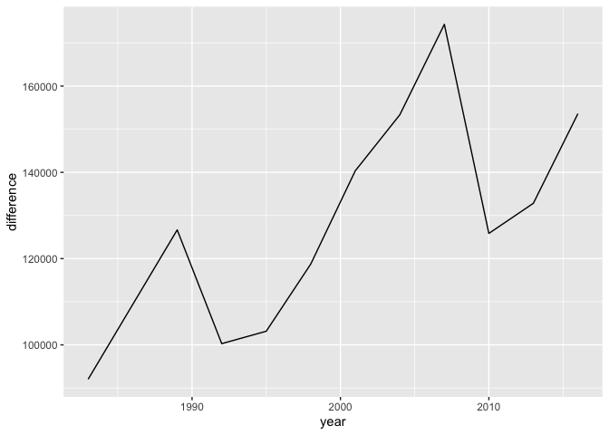
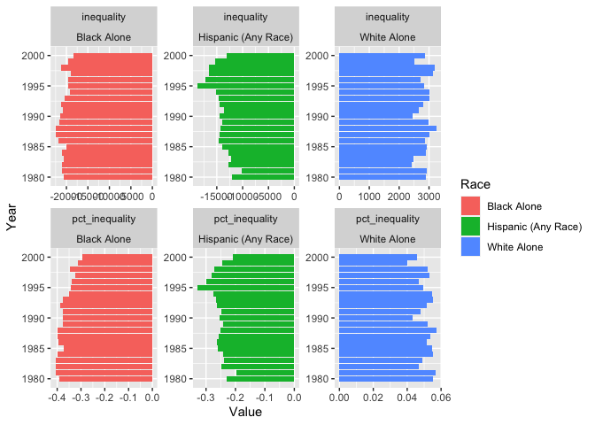
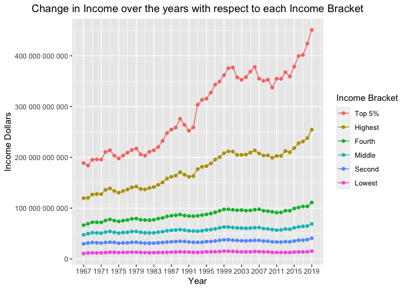
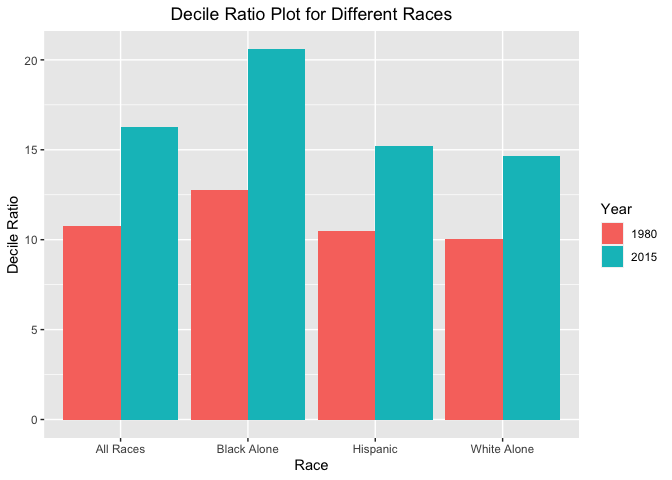

DSA2101_Group_Project_Rmd
================
Brandon Neo Bing Jie, Jiang Ruyang, Ng Elangel, Chow Xin Tian
2023-03-24

## DSA2101 Project - Wealth and Income

### Done by: Brandon Neo, Jiang Ruyang, Ng Elangel, Chow Xin Tian

``` r
# Get the Data

# Read in with tidytuesdayR package 
# Install from CRAN via: install.packages("tidytuesdayR")
# This loads the readme and all the datasets for the week of interest

# Either ISO-8601 date or year/week works!

lifetime_earn <- readr::read_csv('https://raw.githubusercontent.com/rfordatascience/tidytuesday/master/data/2021/2021-02-09/lifetime_earn.csv')
student_debt <- readr::read_csv('https://raw.githubusercontent.com/rfordatascience/tidytuesday/master/data/2021/2021-02-09/student_debt.csv')
retirement <- readr::read_csv('https://raw.githubusercontent.com/rfordatascience/tidytuesday/master/data/2021/2021-02-09/retirement.csv')
home_owner <- readr::read_csv('https://raw.githubusercontent.com/rfordatascience/tidytuesday/master/data/2021/2021-02-09/home_owner.csv')
race_wealth <- readr::read_csv('https://raw.githubusercontent.com/rfordatascience/tidytuesday/master/data/2021/2021-02-09/race_wealth.csv')
income_time <- readr::read_csv('https://raw.githubusercontent.com/rfordatascience/tidytuesday/master/data/2021/2021-02-09/income_time.csv')
income_limits <- readr::read_csv('https://raw.githubusercontent.com/rfordatascience/tidytuesday/master/data/2021/2021-02-09/income_limits.csv')
income_aggregate <- readr::read_csv('https://raw.githubusercontent.com/rfordatascience/tidytuesday/master/data/2021/2021-02-09/income_aggregate.csv')
income_distribution <- readr::read_csv('https://raw.githubusercontent.com/rfordatascience/tidytuesday/master/data/2021/2021-02-09/income_distribution.csv')
income_mean <- readr::read_csv('https://raw.githubusercontent.com/rfordatascience/tidytuesday/master/data/2021/2021-02-09/income_mean.csv')
```

## Introduction

We have analyzed the Wealth and Income dataset, which was provided by
the Urban Institute and the US Census, to compare wealth and income over
time by race. Some of the key datasets that are relevant to the
questions that we seek to investigate in this report are the income
distribution and income mean data. The income distribution table
provides information about the proportion of the population in each
income bracket categorised by race across the years. The income mean
table contains data on the mean income earned by each income quintile
across the years. To contextualise our findings, we referenced articles
on race and income to help explain some of the phenomena.

### Descriptive Statistics

``` r
income_distribution_clean = na.omit(income_distribution)
income_distribution_clean = income_distribution_clean %>%
  mutate(race= as.factor(race), income_bracket = as.factor(income_bracket))
```

With all the commotion surrounding increasing wealth inequality between
races in the USA, we sought to determine if this is indeed the case. To
get an overview of the trend of differences in race wealth in the USA,
we used the race_wealth dataset. In our analysis, we first removed all
the NA values and filtered the data to display only median family wealth
for the races of interest( Blacks and Whites). To compare the difference
in median wealth between the two races, we first spread the dataset and
subsequently, created a “difference” column. This column shows the
difference in median family wealth between the two races throughout the
years. From Figure 0.1, the difference in median family wealth is
generally increasing from a difference of 92044.93 in 1983 to 153591.00
in 2016. The greatest dive in median family wealth between the Blacks
and Whites is around 2007 to 2010 where it fell from 174304.39 in 2007
to 125841.67 in 2010. The fall in difference in median family wealth
between the White and the Black is likely due to the 2008 Global
Financial Crisis.

#### Figure 0.1

``` r
#descriptive stat
wealth = race_wealth %>%
  na.omit()%>%
  filter(type == "Median")%>%
  filter(race == "White" | race == "Black")%>%
  filter(year > 1970)%>%
  spread(race,wealth_family)%>%
  mutate(difference = White - Black)

ggplot(wealth, aes(x = year, y = difference)) +
  geom_line()
```

<!-- -->

From the Box and Whisker plot in Figure 0.2, we observe that Asians
generally have higher median income as compared to the other races while
the Blacks tend to have lower median income as compared to the other
races.

#### Figure 0.2

``` r
descriptive_stat = income_distribution_clean %>%
  select(year, race, income_median, income_bracket) %>%
  filter(race %in% c("All Races", "White Alone", "Black Alone", "Asian Alone", "Hispanic (Any Race)") & income_bracket == "$50,000 to $74,999") %>%
  mutate(race = as.factor(race), income_bracket = as.factor(income_bracket)) %>%
  rename(Race = race)

ggplot(descriptive_stat, aes(x = income_bracket, y = income_median, fill = Race)) +
  geom_boxplot() + 
  labs(x = "Income Bracket", y = "Income Median") + 
  scale_y_continuous(labels = scales::label_number(scale = 1e6)) +
  guides(color = guide_legend(title = "Race"))
```

<!-- -->

The highest recorded value of the income median throughout history was
\$98174, which occurred in 2019 while the lowest recorded value of the
income median throughout history was \$29026 which occurred in 1967.

The number of observations available for Asians was the least among all
the other categories of races which could be attributed to the fact that
migration was not as prevalent in the 1960s and 1970s since the earliest
recorded data available for Asians was only in 1988 in the US.

``` r
summary(income_distribution_clean)
```

    ##       year                             race         number         
    ##  Min.   :1967   All Races                :477   Min.   :  1913000  
    ##  1st Qu.:1985   Black Alone              :477   1st Qu.:  7489000  
    ##  Median :1999   White Alone              :477   Median : 17198000  
    ##  Mean   :1997   Hispanic (Any Race)      :432   Mean   : 45310598  
    ##  3rd Qu.:2009   White Alone, Not Hispanic:414   3rd Qu.: 82368000  
    ##  Max.   :2019   Asian Alone              :288   Max.   :128579000  
    ##                 (Other)                  :324                      
    ##  income_median   income_med_moe  income_mean     income_mean_moe
    ##  Min.   :29026   Min.   : 268   Min.   : 34878   Min.   : 287   
    ##  1st Qu.:42073   1st Qu.: 470   1st Qu.: 56812   1st Qu.: 566   
    ##  Median :55575   Median : 795   Median : 67208   Median : 966   
    ##  Mean   :55223   Mean   :1125   Mean   : 72260   Mean   :1380   
    ##  3rd Qu.:64324   3rd Qu.:1293   3rd Qu.: 86838   3rd Qu.:1505   
    ##  Max.   :98174   Max.   :6080   Max.   :133111   Max.   :8076   
    ##                                                                 
    ##               income_bracket income_distribution
    ##  $100,000 to $149,999:321    Min.   : 0.10      
    ##  $15,000 to $24,999  :321    1st Qu.: 8.10      
    ##  $150,000 to $199,999:321    Median :11.00      
    ##  $200,000 and over   :321    Mean   :11.11      
    ##  $25,000 to $34,999  :321    3rd Qu.:14.50      
    ##  $35,000 to $49,999  :321    Max.   :27.20      
    ##  (Other)             :963

``` r
income_distribution_clean$year[which(income_distribution_clean$income_median == 98174)]
```

    ## [1] 2019 2019 2019 2019 2019 2019 2019 2019 2019

``` r
income_distribution_clean$year[which(income_distribution_clean$income_median == 29026)]
```

    ## [1] 1967 1967 1967 1967 1967 1967 1967 1967 1967

``` r
income_distribution_clean %>%
  filter(race == "Asian Alone") %>%
  arrange(year)
```

    ## # A tibble: 288 × 9
    ##     year race    number income_median income_med_moe income_mean income_mean_moe
    ##    <dbl> <fct>    <dbl>         <dbl>          <dbl>       <dbl>           <dbl>
    ##  1  1988 Asian … 1.91e6         67230           4545       84053            4130
    ##  2  1988 Asian … 1.91e6         67230           4545       84053            4130
    ##  3  1988 Asian … 1.91e6         67230           4545       84053            4130
    ##  4  1988 Asian … 1.91e6         67230           4545       84053            4130
    ##  5  1988 Asian … 1.91e6         67230           4545       84053            4130
    ##  6  1988 Asian … 1.91e6         67230           4545       84053            4130
    ##  7  1988 Asian … 1.91e6         67230           4545       84053            4130
    ##  8  1988 Asian … 1.91e6         67230           4545       84053            4130
    ##  9  1988 Asian … 1.91e6         67230           4545       84053            4130
    ## 10  1989 Asian … 1.99e6         72070           3205       89593            4289
    ## # ℹ 278 more rows
    ## # ℹ 2 more variables: income_bracket <fct>, income_distribution <dbl>

## Question 1: How has racial inequality changed over the years in the United States & what are some potential reasons behind it?

### Introduction:

The income_distribution dataset is used to investigate the question at
hand. This dataset provides information on household income based on
total money income, race, and Hispanic origin of householders, separated
by year and income groups. Our focus is on the median household income
of specific racial groups: All Races, Asian Alone, Black Alone, Hispanic
(Any Race), and White Alone. By examining changes in the median
household income of these racial groups over time, we can gain insight
into how the income of households from different racial backgrounds has
changed in comparison to the national average (All Races).

### Methodology:

We have plotted 2 types of graphs. \* Our investigation begins by
examining the overall trend of income across different racial groups
over time. To do so, we use the following variables “income_median”,
“year”, and “race”. Specifically, we create a time series plot that
shows how the median income changes over the years, with each line
representing different racial groups. This plot presents a clear
overview of income changes for “All Races”, “Asian Alone”, “Black
Alone”, “Hispanic(Any Race)”, and “White Alone”. \* In the second
visualization, the plots in the bottom row shows the bar plot of the
income inequality of the mentioned race divided by the median income of
all races.Income Inequality of Race x = Income Median of Race x / Income
Median of All Races Percentage Inequality of Race x = Income Inequality
of Race x / Income Median of All Races For the bottom row, we can
interpret the graphs as follows: A negative percentage inequality as
observed from the bottom left Blacks curve suggest that the Blacks on
average are earning 40% less relative to the population median for the
year 1980. This presents a clear view on the median income of each race
relative to the median income of the whole population.

### Visualization

#### Question 1 Plot 1 (Figure 1.1)

``` r
#Median Income of Different Races againt Time
ggplot(descriptive_stat, aes(x = year, y = income_median, color = Race)) +
  geom_line() +
  labs(x = "Year", y = "Median Income", 
       title = "Median Income of Different Races against Time") +
  scale_x_continuous(breaks = seq(min(descriptive_stat$year), max(descriptive_stat$year), 4)) +
  scale_y_continuous(labels = scales::label_number(scale = 1e6)) + 
  theme(plot.title = element_text(hjust = 0.5)) +
  guides(color = guide_legend(title = "Race"))
```

<!-- -->

##### Black Inequality

``` r
all_races_overtime = income_distribution %>%
  filter(race == "All Races" & income_bracket == "$50,000 to $74,999") %>%
  select(year, race, income_median) %>%
  rename(income_median_all_races = income_median)

black_adjusted = income_distribution %>%
  filter(race == "Black Alone" & income_bracket == "$50,000 to $74,999") %>%
  select(year, race, income_median) %>%
  rename(income_median_black = income_median)

black_merged = black_adjusted %>%
  left_join(all_races_overtime, by = "year") %>%
  select(-race.y) %>%
  mutate(inequality = income_median_black - income_median_all_races) %>%
  mutate(pct_inequality = inequality/income_median_all_races)
```

##### White Inequality

``` r
white_adjusted = income_distribution %>%
  filter(race == "White Alone" & income_bracket == "$50,000 to $74,999") %>%
  select(year, race, income_median) %>%
  rename(income_median_white = income_median)

white_merged = white_adjusted %>%
  left_join(all_races_overtime, by = "year") %>%
  select(-race.y) %>%
  mutate(inequality = income_median_white - income_median_all_races) %>%
  mutate(pct_inequality = inequality/income_median_all_races)
```

##### Asian Inequality

``` r
asian_adjusted = income_distribution %>%
  filter(race == "Asian Alone" & income_bracket == "$50,000 to $74,999") %>%
  select(year, race, income_median) %>%
  rename(income_median_asian = income_median)

asian_merged = asian_adjusted %>%
  left_join(all_races_overtime, by = "year") %>%
  select(-race.y) %>%
  mutate(inequality = income_median_asian - income_median_all_races) %>%
  mutate(pct_inequality = inequality/income_median_all_races)
```

##### Hispanic Inequality

``` r
hispanic_adjusted = income_distribution %>%
  filter(race == "Hispanic (Any Race)" & income_bracket == "$50,000 to $74,999") %>%
  select(year, race, income_median) %>%
  rename(income_median_hispanic = income_median)

hispanic_merged = hispanic_adjusted %>%
  left_join(all_races_overtime, by = "year") %>%
  select(-race.y) %>%
  mutate(inequality = income_median_hispanic - income_median_all_races) %>%
  mutate(pct_inequality = inequality/income_median_all_races)
```

#### Question 1 Plot 2 (Figure 1.2)

``` r
#using facet_wrap to plot side by side graphs comparison
black_facetplot = black_merged %>%
  filter(year >= 1980 & year <= 2000) %>%
  rename(race = race.x) %>%
  select(year, race, inequality, pct_inequality)

white_facetplot = white_merged %>%
  filter(year >= 1980 & year <= 2000) %>%
  rename(race = race.x) %>%
  select(year, race, inequality, pct_inequality)

hispanic_facetplot = hispanic_merged %>%
  filter(year >= 1980 & year <= 2000) %>%
  rename(race = race.x) %>%
  select(year, race, inequality, pct_inequality)
  
facetplot_df = rbind(black_facetplot, white_facetplot, hispanic_facetplot)


facet_wrap_plot = facetplot_df %>%
  gather(key=measures, value = "Value", c("inequality", "pct_inequality")) %>%
  rename(Race = race, Year = year)


#Facet Plot
ggplot(facet_wrap_plot, aes(x=Year, y=Value, fill=Race)) +
  geom_bar(stat="identity") + 
  coord_flip() +
  facet_wrap(measures ~ Race, scales="free")
```

<!-- -->

### Discussions:

From the first plot (Figure 1.1), it is evident that the median income
of all racial groups in the United States has increased from 1967 to
2019. However, the data also highlights that particular racial groups,
namely Hispanic (Any Race) and Black Alone, have consistently faced
lower median income compared to the overall median income for all races.
Conversely, certain racial groups, such as Asian Alone and White Alone,
have consistently received higher income than the population median
income. Thus, to further study this income difference between racial
groups, we zoom in to look at the income inequality faced by different
racial groups from 1980 to 2000.

This is supported by our second plot (Figure 1.2). We observe that in
Figure 1.2, income inequality generally improves for the Blacks, as the
percentage inequality has bcomes more positive from the 1980s to the
2000s. From the 1980s to 2000s, the Blacks have become increasingly more
educated. (Hoffman, 2004) Black entrants to the labour market were thus
found to have higher levels of skill allowing them to take up more
complex, higher paying jobs. This leads to an increase in median wages
for the Blacks. Although the Hispanic population has experienced similar
progress in educational inclusivity, they appear to exhibit a slower
pace of advancement in addressing income inequality. This may be due to
the significant number of Latino immigrants who have migrated to the
United States from 1980s to 2000s and taken up low-paying, low-skilled
jobs.

In our analysis, we could only account for family types that have
non-mixed races as from the dataset, there is inherently double counting
of observations for overlapping mixed and unmixed races. Furthermore, we
did not manage to include Asian in our second analysis as the data on
Asian population was incomplete (1987 onwards) for the time period we
are studying.

## Question 2: How has class inequality evolved in the US throughout the years and what are some of the potential causes of this phenomenon?

### Introduction:

The purpose of this inquiry is to examine the impact of class division
on income inequality in the United States. To investigate the class
divide, we will utilize the data set “income_mean,” which presents the
average income earned by each quintile and the top 5% of individuals
from various racial groups. Our aim is to investigate the relationship
between class division and problem 1. This is so that we can determine
whether class division or racial division is the primary cause of
inequality in the United States.

### Methodology:

The first visualisation (Figure 2.1) is the change in income over the
years with respect to each income bracket. We plot the mean income of
different income brackets (i.e. “Top 5%”, “Highest Quintile”, and
“Lowest Quintile”) of all races across the year in the US. This gives us
a time-series plot with 6 different lines. This plot is effective in
visualising how the mean income of different income groups have changed
over the years. In the second visualisation (Figure 2.2) , we compared
the change in decile ratio between the races in 1980 and in 2015. To
measure income inequality, we made use of the decile ratio which
compares the income of the top 20% earners in the population to the
income of the bottom 20% earners. We calculated the decile ratio using
the formula:

Decile Ratio = Mean Income of the Richest 20% / Mean Income of the
Poorest 20%

We made use of a bar plot to illustrate this relationship because we are
interested in comparing how the decile ratios have changed over the two
selected time frames for different races. The bar plot serves as a
useful tool in this scenario because we are able to segment each race
according to different bars in the plot.

### Visualizations

#### Question 2 Plot 1 (Figure 2.1)

``` r
income_class = income_mean %>%
  filter(race == "All Races" & dollar_type == "2019 Dollars")

ggplot(income_class, aes(x = year, y = income_dollars, color = income_quintile)) +
  geom_point() + 
  geom_line() + 
  labs(x = "Year", y = "Income Dollars" , 
       title = "Change in Income over the years with respect to each Income Bracket") +
  scale_x_continuous(breaks = seq(min(income_class$year), max(income_class$year), 4)) +
  scale_y_continuous(labels = scales::label_number(scale = 1e6)) +
  scale_color_discrete(limits = c("Top 5%", "Highest", "Fourth", "Middle", "Second", "Lowest")) + 
  guides(color = guide_legend(title = "Income Bracket")) + 
  theme(plot.title = element_text(hjust = 0.5))
```

<!-- -->

#### Question 2 Plot 2 (Figure 2.2)

``` r
#All Races 
decile_2015_all = income_mean %>%
  filter((year == 2015) & dollar_type == "2019 Dollars" & race == "All Races") %>%
  filter(income_quintile == "Lowest" | income_quintile == "Highest") %>%
  spread(key = income_quintile, value = income_dollars) %>%
  mutate(decile_ratio = Highest/Lowest)

decile_1980_all = income_mean %>%
  filter((year == 1980) & dollar_type == "2019 Dollars" & race == "All Races") %>%
  filter(income_quintile == "Lowest" | income_quintile == "Highest") %>%
  spread(key = income_quintile, value = income_dollars) %>%
  mutate(decile_ratio = Highest/Lowest)

#Black
decile_2015_black = income_mean %>%
  filter((year == 2015) & dollar_type == "2019 Dollars" & race == "Black Alone") %>%
  filter(income_quintile == "Lowest" | income_quintile == "Highest") %>%
  spread(key = income_quintile, value = income_dollars) %>%
  mutate(decile_ratio = Highest/Lowest)

decile_1980_black = income_mean %>%
  filter((year == 1980) & dollar_type == "2019 Dollars" & race == "Black Alone") %>%
  filter(income_quintile == "Lowest" | income_quintile == "Highest") %>%
  spread(key = income_quintile, value = income_dollars) %>%
  mutate(decile_ratio = Highest/Lowest)

#White
decile_2015_white = income_mean %>%
  filter((year == 2015) & dollar_type == "2019 Dollars" & race == "White Alone") %>%
  filter(income_quintile == "Lowest" | income_quintile == "Highest") %>%
  spread(key = income_quintile, value = income_dollars) %>%
  mutate(decile_ratio = Highest/Lowest)

decile_1980_white = income_mean %>%
  filter((year == 1980) & dollar_type == "2019 Dollars" & race == "White Alone") %>%
  filter(income_quintile == "Lowest" | income_quintile == "Highest") %>%
  spread(key = income_quintile, value = income_dollars) %>%
  mutate(decile_ratio = Highest/Lowest)


#Hispanic
decile_2015_hispanic = income_mean %>%
  filter((year == 2015) & dollar_type == "2019 Dollars" & race == "Hispanic") %>%
  filter(income_quintile == "Lowest" | income_quintile == "Highest") %>%
  spread(key = income_quintile, value = income_dollars) %>%
  mutate(decile_ratio = Highest/Lowest)

decile_1980_hispanic = income_mean %>%
  filter((year == 1980) & dollar_type == "2019 Dollars" & race == "Hispanic") %>%
  filter(income_quintile == "Lowest" | income_quintile == "Highest") %>%
  spread(key = income_quintile, value = income_dollars) %>%
  mutate(decile_ratio = Highest/Lowest)


#Merged for Decile Plotting
decile_all = rbind(decile_2015_all, decile_1980_all)
decile_black = rbind(decile_2015_black, decile_1980_black)
decile_white = rbind(decile_2015_white, decile_1980_white)
decile_hispanic = rbind(decile_2015_hispanic, decile_1980_hispanic)
decile_final = rbind(decile_all, decile_black, decile_white, decile_hispanic)

ggplot(decile_final, aes(x = race, y = decile_ratio, fill = factor(year))) + 
         geom_bar(stat = "identity", position = position_dodge()) +
         labs(x = "Race", y = "Decile Ratio", fill = "Year") +
         ggtitle("Decile Ratio Plot for Different Races") + 
         theme(plot.title = element_text(hjust = 0.5)) 
```

<!-- -->

### Discussions:

In the first plot, we can observe that the mean income of the top 5% of
the population among all races has increased drastically throughout the
years. In contrary, the mean income of the lower income bracket
(i.e. “Lowest”, “Second”, “Middle”) has barely increased from 1967 to
2019. Hence, we can observe a trend of widening income gap throughout
the year where the rich has been getting richer & the poor has been
getting poorer.

The widening income gap is also supported by the second plot. In the
second plot, we compared the decile ratio between the different races in
1980 and in 2015. We observe that the decile ratio increased for every
single race in 2015 as compared to 1980. As mentioned previously, decile
ratio is the ratio of the income mean of the richest 20% by that of the
poorest 20%. An increase in decile ratio simply means that the
difference between the income mean at 80th percentile and the 20th
percentile is relatively larger. This suggests that, for every single
race, there is greater dispersion in Fig 2.2 and thus the income mean
gap between the 80th percentile and 20th percentile has widened in 2015
compared to 1980.

From the 2 plots, we can conclude that the mean income gap has widened
over the years. This is not surprising as it has been a clear trend
among most of the countries where the rich are getting richer. The sheer
scale of the wealth of the rich means that they are more likely to earn
more from their investment, both the high-risk and low-risk ones. When
considering a specific portfolio allocation, individuals with greater
wealth are more likely to receive higher risk-adjusted returns,
potentially due to their access to exclusive investment opportunities or
superior wealth management services. These attributes contribute to the
persistent returns on wealth observed over time. (Malacrino, 2020)

### Exogeneous Limitations:

In our analysis, we have chosen to only look at the data corresponding
to non-mixed races as we acknowledge from the author of the data set
that there is inherently double counting of observations for overlapping
mixed and unmixed races. We have chosen to exclude the Asian race in our
decile ratio plot as the earliest data we have for Asians in the income
mean dataset dates back to 2002. We feel that the timeframe between 2002
and 2015 is too short for us to explain any possible trends. Therefore,
our analysis and conclusions are limited to non-mixed races and
non-Asians and may not be fully representative of class inequality in
the US.

### References:

- Gregory, J. (2015). Latinx Great Migrations - History and Geography.
  Civil Rights and Labour History Consortium, University of Washington.
  Retrieved April 14, 2023, from
  <https://depts.washington.edu/moving1/latinx_migration.shtml>
- Hoffman, K., & Llagas, C. (2004). Status and trends in the education
  of blacks. PsycEXTRA Dataset. <https://doi.org/10.1037/e609922011-020>
- Kerner, O., & Kerner, O. (1968). Introduction. In Report of the
  National Advisory Commission on civil disorders (pp. 1–29).
  introduction, For sale by the Supt. of Docs., U.S. Govt. Print. Off.
  Orfield, G., & Jarvie, D. (2020). (rep.). BLACK SEGREGATION MATTERS.
  Retrieved April 11, 2023, from
  <https://www.civilrightsproject.ucla.edu/research/k-12-education/integration-and-diversity/black-segregation-matters-school-resegregation-and-black-educational-opportunity/BLACK-SEGREGATION-MATTERS-final-121820.pdf>.
- Smith, T. M. (1995). (rep.). THE EDUCATIONAL PROGRESS OF BLACK
  STUDENTS. Retrieved April 11, 2023, from
  <https://nces.ed.gov/pubs95/95765.pdf>.
- Malacrino, D. (2020, November 30). How the Rich Get Richer. IMF.
  Retrieved April 11, 2023, from
  <https://www.imf.org/en/Blogs/Articles/2020/11/30/how-the-rich-get-richer>
- Rfordatascience, jonthegeek. (2022, November 30).
  Tidytuesday/readme.md at master · rfordatascience/tidytuesday. GitHub.
  Retrieved April 11, 2023, from
  <https://github.com/rfordatascience/tidytuesday/blob/master/data/2021/2021-02-09/readme.md>
- Status and trends in the education of Blacks - National Center for …
  (n.d.). Retrieved April 11, 2023, from
  <https://nces.ed.gov/pubs2003/2003034.pdf>
- Black Segregation Matters - University of California, Los Angeles.
  (n.d.). Retrieved April 11, 2023, from
  <https://www.civilrightsproject.ucla.edu/research/k-12-education/integration-and-diversity/black-segregation-matters-school-resegregation-and-black-educational-opportunity/BLACK-SEGREGATION-MATTERS-final-121820.pdf>
- REPORT OF THE NATIONAL ADVISORY COMMISSION ON CIVIL DISORDERS. (n.d.).
  Retrieved from <http://www.eisenhowerfoundation.org/docs/kerner.pdf>
